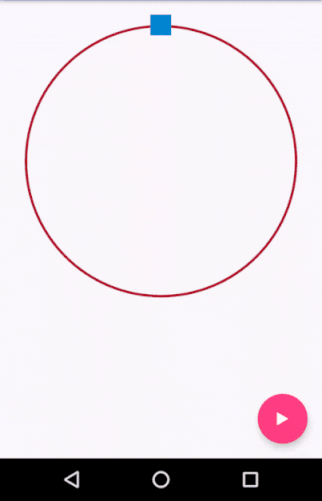

# AnalogCountdownView



***

## Sample Usage

Here is how you can use it in your layout
```xml
<com.cipherthinkers.analogcountdownview.AnalogCountdownView
        android:id="@+id/analogcountdownview"
        android:layout_width="match_parent"
        android:layout_height="match_parent"
        app:progress_width="3dp"
        app:progress_color="#b91427"
        app:total_value="300"
        app:initial_value="300"
        app:increment="false"
        app:timer_icon="@mipmap/ic_clock"
        app:interval_ms="50"/>
```

Here is how you can start your timer:
```java
AnalogCountdownView mAnalogCountdownView = (AnalogCountdownView)findViewById(R.id.analogcountdownview);
AnalogCountdownView.AnalogTimerUpdateListenr mAnalogTimerUpdateListener = new AnalogCountdownView.AnalogTimerUpdateListener() {
    @Override
    public void onTimerUpdated(int currentValue, int totalValue) {

    }

    @Override
    public void onTimerStarted() {
        
    }

    @Override
    public void onTimerExpired() {
              
    }
};

//To start the timer
mAnalogCountdownView.start(mAnalogTimerUpdateListener);
```
Please refer to the sample app for more information on how to use this view.

## Features

Here is the list of attributes/customizations that you can do:

1. start_angle - Defines the angle at which the countdown will start/end (Default value : 270 i.e. up as shown in the screenshot)
2. total_value - Defines the total value. The timer will continue till the current value reaches the total value (in case the increment is true) or 0 (in case increment = false)
3. initial_value - Defines the initial value at which the timer should start
4. progress_width - Defines the width of the circular progress, in dp (Default value : 3dp)
5. progress_color - Defines the color of the progress (Default value Color.BLUE)
6. timer_icon - Drawable resource which will be used as an anchor for the timer
7. icon_size - Size of the timer_icon
8. increment - Decides whether the timer should go from initial value to final value in an increment fashion or not
9. interval_ms - Time interval after which the value should be incremented/decremented, in ms (Default value : 1000)
10. start_delay_ms - Puts a delay in the timer whenever the timer si started, in ms (Default value : 0)

##License

```AnalogCountdownView``` is released under Apache 2.0 license.
